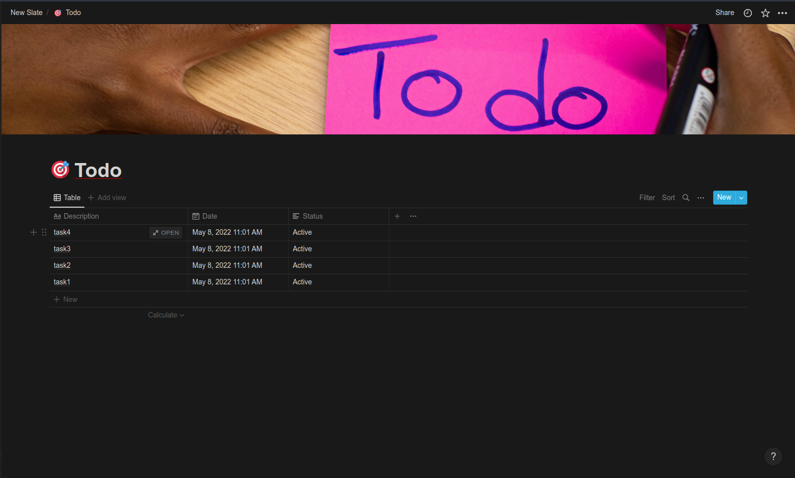

# Slate

Tasks are powerful and important to track your progress. However, creating a task in a meeting, at your desk and on the go can take time and effort.<br>
Slate lets you create tasks quickly with a simple command line command directly into notion, without logging into your account. 🚀

## Adding Tasks

<br>
<br>

## Notion Page



## Commands

Run without arguements to use voice commands 

```bash
  $ python slate.py
```

To add a new task to your notion database

```bash
   $ python slate.py add [TASK]
```

To remove an existing task from your notion database

```bash
  $ python slate.py remove [TASK_NUM]
```

To uncheck an existing task in your notion database

```bash
  $ python slate.py uncheck [TASK_NUM]
```

To list all existing unchecked tasks in your notion database

```bash
  $ python slate.py list
```

To open this help

```bash
   $ python slate.py help
```

